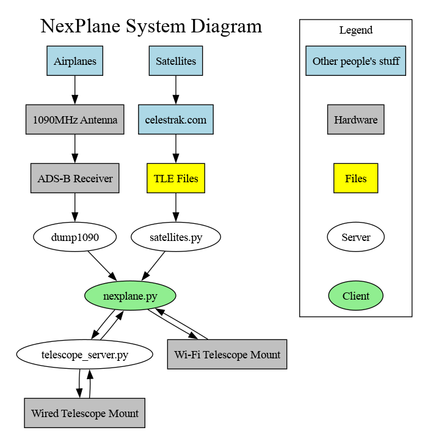

# SAFETY WARNING

NexPlane can drive your telescope quickly, possibly in directions you do not expect.
Though it makes an effort to avoid pointing at the Sun, you could easily misconfigure
NexPlane (or it could suffer a catastrophic failure) such that this might happen anyway.
**Pointing a telescope at the Sun is very dangerous and could permanently damage your vision**
(or your telescope)! It is your responsiblity to remain aware of the locations of the Sun
and your telescope at all times and take whatever steps are necessary with your equipment
to avoid disaster. Additionally, many telescopes may not be able to point in certain directions
without having parts of themselves collide, possibly causing damage. NexPlane has no way to know
which directions these are, so you must be careful about this as well. Do not let NexPlane run
unattended.

NexPlane comes with **absolutely no warranty**, and use of NexPlane is entirely **at your own risk**.

# EXPERIMENTAL BRANCH WARNING

This is an experimental branch of the software. It has not been well tested. The purpose of
publishing this branch is to transport the software to computers where it can be tested.
You should probably use the master branch instead unless you have a Sky-Watcher mount and
are feeling adventurous.

Notes from a field test with a Sky-Watcher AZ-EQ6:

- WARNING: Sometimes the on-screen representation of the telescope's location froze, and the
  telescope kept running. I found that pressing buttons on the hand controller stopped the
  motion. It would be good to try reproducing this in a controlled setting to debug it.
- The motors run in the correct directions.
- Tracking is very smooth, pointing accuracy seems comparable to the NexStar 8SE mount.
- Alignment to "landmarks" in the sky works well.
- Significant manual corrections are needed as the telescope moves to different parts of the
  sky, but the size and direction of the corrections seems roughly consistent in particular
  areas. Pointing accuracy seems to be best in the part of the sky near the chosen landmark.
  perhaps a system for alignment to multiple landmarks could be devised? This would require
  significant UI changes.
- It would be really great to have a way to save and restore alignment so that if the
  mount head stays on the alignment can be preserved even if NexPlane restarts.

Quick summary of new features:

- Support is added for the Sky-Watcher AZ-EQ6 mount. Other similar Sky-Watcher mounts like
  the EQ6-R and AZ-GTi are likely to work too.
- There's a new command line option called `--telescope-protocol`, and a corresponding
  config parameter called `telescope_protocol` which sets its defult value. This option can
  take on the following values:
  - `nexstar-hand-control` - Your computer is plugged into a NexStar mount's hand controller.
  - `skywatcher-mount-head-usb` - Your computer is plugged into a Sky-Watcher mount head (not
    the hand controller) with a USB cable.
  - `skywatcher-mount-head-eqmod` - Your computer is plugged into a Sky-Watcher mount head (not
    the hand controller) with an EQMOD cable.
  - `skywatcher-mount-head-wifi` - Your computer is connected to a Sky-Watcher mount head
    via Wi-Fi. If using this option, DO NOT start `telescope_server.py`. Instead, pass
    `--telescope <IP address of mount head on the wifi>:11880` to `nexplane.py`, and the
    mount head itself will be the server.
- Unlike for NexStar mounts, Sky-Watcher mounts are not able to report their position to
  NexPlane in an aligned coordinate system. You therefore must use `--landmark` alignment
  with Sky-Watcher mounts.
- `--landmark` alignment now works with equatorial mounts.
- The `--landmark` alignment option has been extended with a new capability: you can now align
  to a "landmark" in the sky. To align on Jupiter, specify `--landmark sky:jupiter`. To align
  on Sirius, specify `--landmark sky:sirius`. Aligning on bodies outside the solar system
  requires an internet connection.
- The HOOTL simulator can now optionally be run inside the telescope server, or in the new
  `skywatcher_wifi_hootl.py` server, instead of inside `nexplane.py`. This allows end-to-end
  testing of the network stack. This has given `telescope_server.py` some new options.
- A new `run_test.py` script can run a useful battery of tests on NexPlane.
- Compatibility with Python 3.9 and earlier is officially broken. I have not tested Python3.10.
  Python3.11 and later are supported.
- Network robustness is improved, and there's a warning in red text in the middle of the
  screen when communication failures are detected.
- Trackable targets are now displayed in gray if they're in space.
- The back of the telescope will be illustrated if the telescope is pointed at the ground.

# NexPlane

NexPlane can help you drive a Celestron or Sky-Watcher telescope mount to track
airplanes and satellites. See the [Requirements](#requirements) section for a list of supported models.

In order to track airplanes, you will need a source of live data about airplanes near you in
SBS-1 (BaseStation) format. An easy way to generate such data is with an
[ADS-B radio receiver](https://flightaware.com/adsb/piaware/build/) and
[Dump1090](https://github.com/antirez/dump1090).

In order to track satellites, you will need recent TLE files downloaded from CelesTrak. These will
be read by `satellites.py`, which will then emit SBS-1 (BaseStation) format data so that NexPlane
can pretend that they are very fast, very high altitude airplanes.

Because all the software elements communicate over the network, you may place them on separate
computers if you wish. Though technically you could place some of them in the cloud or otherwise
disperse them across the Internet, you should probably try to keep them all close together to
minimize latency. Furthermore, none of the communication between the pieces of NexPlane is
authenticated, so it would be your responsibility to figure out how to keep hooligans from
comandeering your telescope. Personally, I run `telescope_server.py` on a Raspberry Pi
connected to my telescope mount, and everything else on a laptop, with the two communicating
directly by Wi-Fi.

## Requirements

- Linux
- Your Linux distro's GLUT package (on Ubuntu that's `libglut-dev`, on Arch that's `freeglut`).
- Python 3.11 or later, and the Pip packages spelled out in `requirements.txt`.
  Python 3.10 may work, but has not been tested. Python 3.9 or earlier will not work.
  Check your python version with `python3 --version`.
- A supported Celestron or Sky-Watcher Go-To telescope mount.
- If you want to look at airplanes: an ADS-B receiver and antenna.

The following telescope mounts have been **tested and shown to work**.

- **Celestron** mounts
  - NexStar SE mount for the 8SE and 6SE models
- **Sky-Watcher** mounts
  - AZ-EQ6 PRO, but only with motor controller firmware version 3.39 or later.
  - AZ-GTi. Probably also requires motor controller firmware version 3.39 or later.

These models are **likely to work**, but have not been tested.
If you have one and it works, please let me know so I can add it to the list above.

- **Celestron** mounts that have a NexStar hand controller attached to them with a cable.
  - Advanced VX series (aka AVX)
  - CGEM II series
  - CGX
  - CGX-L series
  - CPC Deluxe HD series
  - CPC series
  - LCM series
  - NexStar Evolution series
  - NexStar SE mount for the 5SE and 4SE models
  - NexStar SLT series
  - SkyProdigy series
- **Sky-Watcher** mounts that have a SynScan hand controller attached to them with a cable,
  and motor controller firmware version 3.39 or later.
  - CQ350 PRO
  - EQ3 PRO
  - EQ5 PRO
  - EQ6 PRO
  - EQ6R PRO
  - EQ8 PRO
  - EQM-35 PRO
  - HEQ5 PRO
  - Virtuoso
- **Sky-Watcher** mounts that connect to a smart phone by Wi-Fi. They probably also require
  motor controller firmware 3.39 or later.
  - AZ-GTiX
  - Star Adventurer GTi

These models are **probably not going to work** without modifications to NexPlane.
If you have such a mount and are willing to experiment, open a GitHub issue and if I have time
I might be able to help you. No promises.

- **Celestron** mounts that connect to a smart phone by Wi-Fi.
  - Astro Fi series
  - Origin

These models **may never work**, but you're welcome to try.

- **Sky-Watcher** mounts for which motor controller firmware version 3.39 or later is not available.
  They will probably move, but they will not be able to smoothly track moving targets.
  - AllView
  - AZ SynScan
  - AZ-EQ5 PRO
- **Sky-Watcher** mounts which do not appear to have full Go-To capability
  (but I've never tested them myself).
  - Star Adventurer
  - Star Adventurer Mini Wi-Fi

## Getting Started

### Configuration

You will need to set up a Python virtualenv and install the required packages.

    $ python3 -m venv venv
    $ . venv/bin/activate
    $ pip install -r requirements.txt

Begin by configuring NexPlane with your current location. NexPlane comes with a file called
`config_default.yaml`, which you may examine to see the configuration syntax and the default
values of things. You will want to create a new file in the same directory called `config.yaml`
in which you override anything in the default configuration that does not apply to you.
NexPlane will read both files when it starts up, so you don't need to copy everything from
`config_default.yaml`. To set your current location, put something like this in `config.yaml`:

    locations:
        home:
            lat_degrees: 38.879084
            lon_degrees: -77.036531
            alt_meters: 18.0

    location: home

You can verify that this worked and see how your new `config.yaml` file was combined with
`config_default.yaml` by running `dump_config.py`:

    $ ./dump_config.py
    gains:
      kd: 0.1
      ki: 0.1
      kp: 1.0
    hootl: false
    landmark: null
    location: home
    locations:
      griffith:
        alt_meters: 346.0
        lat_degrees: 34.118874
        lon_degrees: -118.300536
      hollywood_sign:
        alt_meters: 481.0
        lat_degrees: 34.134046
        lon_degrees: -118.321633
      home:
        alt_meters: 18.0
        lat_degrees: 38.879084
        lon_degrees: -77.036531
      mt_wilson:
        alt_meters: 1742.0
        lat_degrees: 34.222901
        lon_degrees: -118.062696
    mount_mode: altaz
    sbs1_servers:
    - localhost:30003
    - localhost:40004
    serial_port: auto
    telescope_protocol: nexstar-hand-control
    telescope_server: localhost:45345
    tle_files:
    - tle/visual.txt
    - tle/stations.txt

### Basic test with no hardware attached

The simplest way kick the tires is a pure software test (no telescope or other hardware attached).
Start by downloading some TLE files from [CelesTrak](https://celestrak.com/):

    $ cd tle
    $ ./fetch.sh
    $ cd ..

This will download several interesting collections of satellite data for you to play with,
and store them as `.txt` files in the `tle/` directory. Now you can start up `satellites.py`,
a server that will compute the current trajectories of satellites. It will publish them on TCP
port 40004.

    $ ./satellites.py
    Listening on port 40004

In a separate terminal, start up `nexplane.py` in Hardware Out Of The Loop (HOOTL) test mode.
This will act as though it is controlling a real telescope, but in fact it will only control a simulation.

    $ . venv/bin/activate
    $ ./nexplane.py --hootl

It will open a window that looks like this:

This is an equirectangular projection of the sky. The horizon is the green line at the bottom.
The top of the screen is straight up. South is in the middle, and North is at the sides.
The current position of the telescope is the red cross with a circle around it.
Satellites appear as white crosses with labels. Airplanes (if you connect an ADS-B receiver)
are the same but blue. Coloration is determined by altitude.

The Sun and Moon are drawn too, with big yellow circles around the Sun to help you judge when
you're getting dangerously close. An important safety feature of NexPlane is that if your telescope
strays into the yellow circles around the Sun, NexPlane will immediately stop the telescope and
will refuse to move it. You will have to use your telescope's hand controller to move your telescope
away from the Sun (because you don't have a physical telescope in HOOTL, your only recovery option
will be to restart `nexplane.py`).

To being tracking a target, click on it. It will turn orange, and the telescope will move
towards it. You will also notice a lighter orange cross appear nearby. The white, blue, or orange crosses
indicate the *last known* positions of targets, updated whenever `nexplane.py` receives an update
from `dump1090` or `satellites.py`. The lighter orange cross indicates the *current estimated*
position, based on the last known position, the last known velocity, and how old the data is.
This is where the telescope will point.

Once the telescope is pointed near the target, you may then apply manual corrections with the
keyboard, as described in the next section.

### Keyboard/Mouse controls

These are the most frequently used buttons:

| Button     | Effect                        |
| ---------- | ----------------------------- |
| Left mouse | Begin tracking target         |
| Escape     | Stop tracking target          |
| w or k     | Small manual correction up    |
| s or j     | Small manual correction down  |
| a or h     | Small manual correction left  |
| d or l     | Small manual correction right |
| W or K     | Large manual correction up    |
| S or J     | Large manual correction down  |
| A or H     | Large manual correction left  |
| D or L     | Large manual correction right |
| q or o     | Reset manual corrections      |

Note that up and down correspond to elevation above the horizon and left and right correspond
to azimuth. This is true no matter whether your mount is in alt/az mode or equatorial mode.
For example, if you have an equatorial mount, pressing "W" will apply an offset in both right
ascension and declination in order to achieve the correction you specified in elevation.

There are also buttons for adjusting the PID controller gains, which you can experiment with
if the default gain set is not to your liking. Whenever you make an adjustment the PID
controllers will reset any controller wind-up and the new gain set will be printed to the
console.

| Button | Effect                             |
| ------ | ---------------------------------- |
| r      | Increase proportional gain by 0.01 |
| f      | Decrease proportional gain by 0.01 |
| t      | Increase integral gain by 0.01     |
| g      | Decrease integral gain by 0.01     |
| y      | Increase differential gain by 0.01 |
| u      | Decrease differential gain by 0.01 |

Once you find a gain set you like, you can add it to `config.yaml`.

    gains:
        kp: 1.0
        ki: 0.1
        kd: 0.1

### Hook up your telescope mount

How you attach your telescope mount to your computer depends on the kind of mount you have.

- If you have a Celestron mount with a NexStar hand controller, connect the hand controller
  to your computer with a USB cable (or on very old models, a serial cable).
- If you have a Sky-Watcher mount, you have several choices:
  - Connect the mount head (**not** the SynScan hand controller) to your computer with a USB cable.
  - Unplug the SynScan hand controller and plug your computer into the hand controller port on
    the mount head, using an appropriate cable (sometimes known as an "EQMOD dongle").
    How to buy or build such a cable is beyond the scope of this document.
  - If your mount has Wi-Fi, connect your mount and computer to the same Wi-Fi network and
    determine your mount's IP address. Sky-Watcher's network protocol is unreliable, so this
    option may cause more jittery control than the others.

Set the `telescope_protocol` option in your `config.yaml` file to describe how you connected
your telescope to your computer:

    telescope_protocol: nexstar-hand-control

Valid values are:
- `nexstar-hand-control` is the default, so if you have a Celestron mount then no configuration is needed.
- `skywatcher-mount-head-usb`
- `skywatcher-mount-head-eqmod`
- `skywatcher-mount-head-wifi`

Now, unless you are connecting directly to your mount head with Wi-Fi, run this on the computer with
the telescope mount attached:

    $ ./telescope_server.py

Celestron and Sky-Watcher mounts plug into your computer using either a serial port (older models) or a USB port
(newer models). However, even the newer models are just connecting a serial port emulator chip,
so from the software's perspective it's always just a serial port. By default, `telescope_server.py`
assumes that you are using a USB telescope and that your telescope is the only USB serial device
connected. As such, it scans through `/dev/ttyUSB0` to `/dev/ttyUSB9` and picks the first device
it finds. If you wish to override this behavior to pick (for example) `/dev/ttyS0`, you may put a
line like this in `config.yaml`:

    serial_port: /dev/ttyS0

or you may specify this on the command line:

    $ ./telescope_server.py --serial-port /dev/ttyS0

Running `telescope_server.py` will start a server on port 45345 that provides clients the ability
to send serial commands to the telescope and receive responses. This is not necessary if you are
connecting directly to your mount with Wi-Fi.

Once this is running, restart `nexplane.py` without the `--hootl` option, and it will attach to
the server and command the telescope.

    $ ./nexplane.py

Note that mounts typically store alignment data in the hand controller, not the mount head.
If you are using a Sky-Watcher mount and have therefore bypassed the hand controller, your
telescope will not be correctly aligned. You must follow the steps in the
[Landmark alignment](#landmark-alignment) section.

If you have an equatorial mount, you must specify this in `config.yaml`:

    mount_mode: eq

or you may specify this on the command line:

    $ ./nexplane.py --mount-mode eq

If `nexplane.py` and `telescope_server.py` are running on separate computers, then you will
have to tell NexPlane where to find the telescope server. You can do this by putting something
like this in `config.yaml`:

    telescope_server: 192.168.0.5:45345

or you may specify this on the command line:

    $ ./nexplane --telescope 192.168.0.5:45345

Note that in the case of separate computers, both computers should have the same `config.yaml` file.

Similarly, if you are using Wi-Fi to connect to your telescope, you must specify the IP and port
of your mount head in the `telescope_server` config field. If your Sky-Watcher mount is operating
in access point mode, its IP address will probably be 192.168.4.1. Sky-Watcher mounts accept
connections on port 11880.

    telescope_server: 192.168.4.1:11880

### Get airplane data with Dump1090

If you have an [ADS-B radio receiver](https://flightaware.com/adsb/piaware/build/), you can run
[Dump1090](https://github.com/antirez/dump1090), and `nexplane.py` will consume data from it
just like it will from `satellites.py`. `dump1090` will output data on port 30003 by default,
and `nexplane.py` will look for this.

    $ ./dump1090 --net

If `nexplane.py` and `dump1090` are running on separate computers, then you will have to tell
NexPlane where to find `dump1090`. You can do this by putting something like this in
`config.yaml`:

    sbs1_servers:
        - 192.168.0.6:30003  # dump1090
        - localhost:40004    # satellites.py

or you may specify this on the command line:

    $ ./nexplane.py --sbs1 192.168.0.6:30003 --sbs1 localhost:40004

### Landmark alignment

The usual way to align your telescope mount (if it's a Celestron) is with its built in alignment
routines (SkyAlign, Auto Two-Star Align, etc.). These work fine in many conditions, but if
none of the required celestial objects are visible, or if you're using a Sky-Watcher mount,
NexPlane presents you with another option.

If you can see a landmark on Earth with a known latitude, longitude, and altitude,
add it to `config.yaml`, like so:

    locations:
        home:
            lat_degrees: 38.879084
            lon_degrees: -77.036531
            alt_meters: 18.0
        washington_monument:
            lat_degrees: 38.889475
            lon_degrees: -77.035243
            alt_meters: 190.0

    location: home

Now point your telescope at that landmark, and then tell `nexplane.py` that you have done so
when you start it up.

    $ ./nexplane.py --landmark washington_monument

Alternatively, if you can see a star or planet, tell `nexplane.py` that you're pointing at
that. Using stars as landmarks requires an internet connection to look them up:

    $ ./nexplane.py --landmark sky:jupiter
    $ ./nexplane.py --landmark sky:sirius
    $ ./nexplane.py --landmark sky:betelgeuse

The offset between the known azimuth and elevation to that landmark and the reported azimuth
and elevation from the telescope will be recorded and compensated for. This is similar to
performing a One-Star Align.

## Trouble spots

NexPlane probably contains bugs. It has not been tested by a large number of people or on
diverse mount hardware. If it doesn't work for you, try reading through the code and
making experimental changes to locate the problem. Diagnostic print statements are your
friends!

One source of trouble in my experience has been unreliable networking. NexPlane makes a
basic effort to tolerate network issues, but if you have a drop out for more than a second
or two things are liable to go haywire. Running everything on one computer should fix most
problems in this area. Wired networks are also likely to be more reliable than Wi-Fi.

Another source of trouble is the CPU overloading. I have tried to optimize things well
enough to avoid this on my hardware, but if your computer is slower than mine you may
run into trouble. Further optimization is certainly possible. An important sign that
NexPlane is running up against the limits of your CPU is if one or more cores is running
at 100% utilization (meaning that NexPlane is not taking any time to rest between cycles).

## Command line details

Command line options allow you to override most settings in `config.yaml` on a one-time basis.
The default values for command line options are sourced from the config file, and so will
be different if you have changed the configuration from the default.

### `nexplane.py`

    $ ./nexplane.py --help
    usage: nexplane.py [-h] [--config CONFIG] [--hootl] [--no-hootl] [--bw]
                       [--white-bg] [--location LOCATION] [--landmark LANDMARK]
                       [--telescope TELESCOPE] [--mount-mode MOUNT_MODE]
                       [--telescope-protocol TELESCOPE_PROTOCOL] [--sbs1 SBS1]

    Helps you track airplanes and satellites with a Celestron NexStar telescope mount.

    options:
      -h, --help            show this help message and exit
      --config CONFIG       Specify an additional config file to be read that takes
                            priority over config.yaml and config_default.yaml. This
                            option can be provided multiple times, causing multiple
                            config files to be read, with later ones taking priority
                            over earlier ones. These config files may alter the
                            defaults for other command line arguments, in effect
                            serving as customized short-hand for complex argument
                            combinations.
      --hootl               Do not connect to telescope_server.py, but instead run an
                            internal simulation of the telescope. This is useful for
                            testing.
      --no-hootl            Opposite of --hootl. This is the default
      --bw                  Make the display black and white (this is useful for
                            increasing contrast when operating in direct sunlight).
      --white-bg            Make the display background white (this is useful to read
                            more easily on dimmer screens when operating in direct
                            sunlight).
      --location LOCATION   Where are you? Pick a named location from your config file
                            (default: griffith)
      --landmark LANDMARK   If it is not possible to use the telescope's internal
                            alignment functions (perhaps because it is cloudy), you
                            can manually point the telescope at a location listed in
                            your config file, and then start this program with the
                            --landmark option specifying where the telescope is
                            pointed. The offset between the known location and the
                            telescope's reported position will be recorded and
                            compensated for.
      --telescope TELESCOPE
                            The host:port of the telescope_server.py process, which
                            talks to the telescope mount (default: localhost:45345)
      --mount-mode MOUNT_MODE
                            Type of telescope mount, either altaz or eq. Default:
                            altaz
      --telescope-protocol TELESCOPE_PROTOCOL
                            Which protocol to use to talk to the telescope (default:
                            nexstar-hand-control)
      --sbs1 SBS1           The host:port of an SBS1 server for airplane data. You can
                            specify this argument multiple times in order to receive
                            data from multiple servers. (default: localhost:30003,
                            localhost:40004)

### `telescope_server.py`

    $ ./telescope_server.py --help
    usage: telescope_server.py [-h] [--config CONFIG] [--hootl] [--no-hootl]
                               [--serial-port SERIAL_PORT]
                               [--network-port NETWORK_PORT]
                               [--telescope-protocol TELESCOPE_PROTOCOL]
                               [--location LOCATION] [--mount-mode MOUNT_MODE]

    Exposes the telescope serial interface on the network.

    options:
      -h, --help            show this help message and exit
      --config CONFIG       Specify an additional config file to be read that takes
                            priority over config.yaml and config_default.yaml. This
                            option can be provided multiple times, causing multiple
                            config files to be read, with later ones taking priority
                            over earlier ones. These config files may alter the
                            defaults for other command line arguments, in effect
                            serving as customized short-hand for complex argument
                            combinations.
      --hootl               Do not connect to a telescope via a serial port, but
                            instead run an internal simulation of the telescope. This
                            is useful for testing.
      --no-hootl            Opposite of --hootl. This is the default
      --serial-port SERIAL_PORT
                            Which serial port to use (default: the first port it finds
                            between /dev/ttyUSB0 and /dev/ttyUSB9.)
      --network-port NETWORK_PORT
                            Which network port to use (default: 45345)
      --telescope-protocol TELESCOPE_PROTOCOL
                            Which protocol to use to talk to the telescope (default:
                            nexstar-hand-control)
      --location LOCATION   Where are you? Pick a named location from your config file
                            (default: griffith)
      --mount-mode MOUNT_MODE
                            Type of telescope mount, either altaz or eq. Default:
                            altaz

### `satellites.py`

    $ ./satellites.py --help
    usage: satellites.py [-h] [--config CONFIG] [--location LOCATION] [--port PORT]
                         [tle_files ...]

    Consume TLE files that you downloaded from CelesTrak, and emit SBS-1 data that
    nexplane.py can consume in order to point at satellites.

    positional arguments:
      tle_files            TLE files to consume (default: tle/visual.txt,
                           tle/stations.txt)

    options:
      -h, --help           show this help message and exit
      --config CONFIG      Specify an additional config file to be read that takes
                           priority over config.yaml and config_default.yaml. This
                           option can be provided multiple times, causing multiple
                           config files to be read, with later ones taking priority
                           over earlier ones. These config files may alter the
                           defaults for other command line arguments, in effect
                           serving as customized short-hand for complex argument
                           combinations.
      --location LOCATION  Where are you? Pick a named location from your config file
                           (default: griffith)
      --port PORT          Port to run the SBS-1 server on (default: 40004)

## Advanced software testing

If you are making changes to NexPlane, or you are having trouble and want a more
complete check that the software is good independently of your physical telescope
mount, you can run the full HOOTL test suite.

This will run the MyPy static type checker for Python, and then start NexPlane
over and over again in a variety of configurations. For each such test, the
NexPlane window will open up and you can interact with it. When you close the window,
NexPlane will start again with a different configuration. There are currently 10
such tests.

    $ ./run_test.py

    TEST 0: MyPy
    mypy dump_config.py nexplane.py rpc_client_test.py rpc_server_test.py run_test.py satellites.py skywatcher_wifi_hootl.py telescope_server.py
    Success: no issues found in 8 source files

    TEST 1: NexStar mount in Alt-Az mode
    ./satellites.py tle/geo.txt --location griffith --port 40004
    ./nexplane.py --hootl --location griffith --landmark hollywood_sign --sbs1 localhost:40004 --telescope-protocol nexstar-hand-control --mount-mode altaz
    Listening on port 40004
    New connection

    TEST 2: NexStar mount in Equatorial mode
    ./satellites.py tle/geo.txt --location griffith --port 40004
    ./nexplane.py --hootl --location griffith --landmark hollywood_sign --sbs1 localhost:40004 --telescope-protocol nexstar-hand-control --mount-mode eq
    Listening on port 40004
    New connection

    TEST 3: Sky-Watcher mount with USB in Alt-Az mode
    ./satellites.py tle/geo.txt --location griffith --port 40004
    ./nexplane.py --hootl --location griffith --landmark hollywood_sign --sbs1 localhost:40004 --telescope-protocol skywatcher-mount-head-usb --mount-mode altaz
    Listening on port 40004
    New connection

    TEST 4: Sky-Watcher mount with USB in Equatorial mode, Black and white
    ./satellites.py tle/geo.txt --location griffith --port 40004
    ./nexplane.py --hootl --location griffith --landmark hollywood_sign --sbs1 localhost:40004 --telescope-protocol skywatcher-mount-head-usb --mount-mode eq --bw
    Listening on port 40004
    New connection

    TEST 5: Sky-Watcher mount with EQMOD, White and black
    ./satellites.py tle/geo.txt --location griffith --port 40004
    ./nexplane.py --hootl --location griffith --landmark hollywood_sign --sbs1 localhost:40004 --telescope-protocol skywatcher-mount-head-eqmod --mount-mode eq --bw --white-bg
    Listening on port 40004
    New connection

    TEST 6: Sky-Watcher mount with WiFi, White and color
    ./satellites.py tle/geo.txt --location griffith --port 40004
    ./nexplane.py --hootl --location griffith --landmark hollywood_sign --sbs1 localhost:40004 --telescope-protocol skywatcher-mount-head-wifi --mount-mode eq --white-bg
    Listening on port 40004
    New connection

    TEST 7: Server mode - NexStar mount
    ./satellites.py tle/geo.txt --location griffith --port 40004
    ./telescope_server.py --hootl --location griffith --network-port 45345 --telescope-protocol nexstar-hand-control --mount-mode altaz
    ./nexplane.py --no-hootl --location griffith --landmark hollywood_sign --sbs1 localhost:40004 --telescope-protocol nexstar-hand-control --mount-mode altaz --telescope localhost:45345
    Listening on port 40004
    Starting RPC server...
    Ready.
    New connection

    TEST 8: Server mode - Sky-Watcher mount with USB
    ./satellites.py tle/geo.txt --location griffith --port 40004
    ./telescope_server.py --hootl --location griffith --network-port 45345 --telescope-protocol skywatcher-mount-head-usb --mount-mode altaz
    ./nexplane.py --no-hootl --location griffith --landmark hollywood_sign --sbs1 localhost:40004 --telescope-protocol skywatcher-mount-head-usb --mount-mode altaz --telescope localhost:45345
    Starting RPC server...
    Ready.
    Listening on port 40004
    New connection

    TEST 9: Server mode - Sky-Watcher mount with EQMOD
    ./satellites.py tle/geo.txt --location griffith --port 40004
    ./telescope_server.py --hootl --location griffith --network-port 45345 --telescope-protocol skywatcher-mount-head-eqmod --mount-mode altaz
    ./nexplane.py --no-hootl --location griffith --landmark hollywood_sign --sbs1 localhost:40004 --telescope-protocol skywatcher-mount-head-eqmod --mount-mode altaz --telescope localhost:45345
    Starting RPC server...
    Ready.
    Listening on port 40004
    New connection

    TEST 10: Server mode - Sky-Watcher mount with WiFi
    ./satellites.py tle/geo.txt --location griffith --port 40004
    ./skywatcher_wifi_hootl.py 45345
    ./nexplane.py --no-hootl --location griffith --landmark hollywood_sign --sbs1 localhost:40004 --telescope-protocol skywatcher-mount-head-wifi --mount-mode altaz --telescope localhost:45345
    Listening on port 40004
    New connection

If you wish to run only a couple particular tests, you may specify which ones on the command line:

    $ ./run_test.py 0 4

    TEST 0: MyPy
    mypy dump_config.py nexplane.py rpc_client_test.py rpc_server_test.py run_test.py satellites.py skywatcher_wifi_hootl.py telescope_server.py
    Success: no issues found in 8 source files

    TEST 4: Sky-Watcher mount with USB in Equatorial mode, Black and white
    ./satellites.py tle/geo.txt --location griffith --port 40004
    ./nexplane.py --hootl --location griffith --landmark hollywood_sign --sbs1 localhost:40004 --telescope-protocol skywatcher-mount-head-usb --mount-mode eq --bw
    Listening on port 40004
    New connection

All of the tests run `satellites.py`.

    $ ./satellites.py

Some of these tests are the simple HOOTL simulation described above, performed by
passing --hootl on the command line to `nexplane.py`.

    $ ./nexplane.py --hootl

Others are more advanced and test the network connection between `nexplane.py`
and `telescope_server.py`. In these tests, `nexplane.py` doesn't know it's a test:

    $ ./nexplane.py

and `telescope_server.py` is running the simulator:

    $ ./telescope_server.py --hootl

There's also a separate simulator that impersonates a Sky-Watcher Wi-Fi mount,
used to test that protocol.

    $ ./skywatcher_wifi_hootl.py
