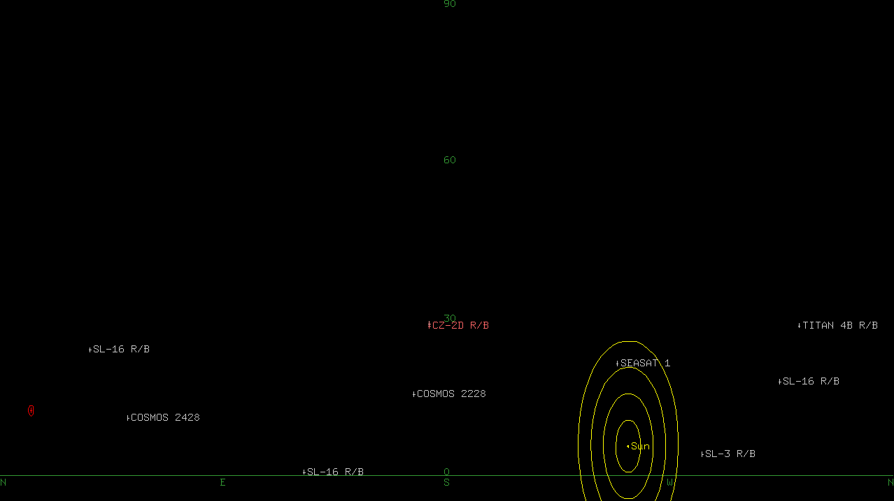

# SAFETY WARNING

NexPlane can drive your telescope quickly, possibly in directions you do not expect.
Though it makes an effort to avoid pointing at the Sun, you could easily misconfigure
NexPlane (or it could suffer a catastrophic failure) such that this might happen anyway.
**Pointing a telescope at the Sun is very dangerous and could permanently damage your vision**
(or your telescope)! It is your responsiblity to remain aware of the locations of the Sun
and your telescope at all times and take whatever steps are necessary with your equipment
to avoid disaster. Additionally, many telescopes may not be able to point in certain directions
without having parts of themselves collide, possibly causing damage. NexPlane has no way to know
which directions these are, so you must be careful about this as well. Do not let NexPlane run
unattended.

NexPlane comes with **absolutely no warranty**, and use of NexPlane is entirely **at your own risk**.

# NexPlane

NexPlane can help you drive a Celestron NexStar telescope mount to track airplanes and satellites.
SynScan mounts will probably work too, but have not been tested.

In order to track airplanes, you will need a source of live data about airplanes near you in
SBS-1 (BaseStation) format. An easy way to generate such data is with an
[ADS-B radio receiver](https://flightaware.com/adsb/piaware/build/) and
[Dump1090](https://github.com/antirez/dump1090).

In order to track satellites, you will need recent TLE files downloaded from CelesTrak. These will
be read by `satellites.py`, which will then emit SBS-1 (BaseStation) format data so that NexPlane
can pretend that they are very fast, very high altitude airplanes.

Because all the software elements communicate over the network, you may place them on separate
computers if you wish. Though technically you could place some of them in the cloud or otherwise
disperse them across the Internet, you should probably try to keep them all close together to
minimize latency. Furthermore, none of the communication between the pieces of NexPlane is
authenticated, so it would be your responsibility to figure out how to keep hooligans from
comandeering your telescope. Personally, I run `telescope_server.py` on a Raspberry Pi
connected to my telescope mount, and everything else on a laptop, with the two communicating
directly by Wi-Fi.

## Requirements

- Linux
- Python 3, and the Pip packages spelled out in `requirements.txt`
- A Celestron NexStar series telescope.
- If you want to look at airplanes: an ADS-B receiver and antenna.

## Getting Started

### Configuration

You will need to set up a Python virtualenv and install the required packages.

    $ python3 -m venv venv
    $ . venv/bin/activate
    $ pip install -r requirements.txt

Begin by configuring NexPlane with your current location. NexPlane comes with a file called
`config_default.yaml`, which you may examine to see the configuration syntax and the default
values of things. You will want to create a new file in the same directory called `config.yaml`
in which you override anything in the default configuration that does not apply to you.
NexPlane will read both files when it starts up, so you don't need to copy everything from
`config_default.yaml`. To set your current location, put something like this in `config.yaml`:

    locations:
        home:
            lat_degrees: 38.879084
            lon_degrees: -77.036531
            alt_meters: 18.0

    location: home

You can verify that this worked and see how your new `config.yaml` file was combined with
`config_default.yaml` by running `dump_config.py`:

    $ ./dump_config.py
    gains:
      kd: 0.1
      ki: 0.1
      kp: 1.0
    hootl: false
    landmark: null
    location: home
    locations:
      griffith:
        alt_meters: 346.0
        lat_degrees: 34.118874
        lon_degrees: -118.300536
      hollywood_sign:
        alt_meters: 481.0
        lat_degrees: 34.134046
        lon_degrees: -118.321633
      home:
        alt_meters: 18
        lat_degrees: 38.879084
        lon_degrees: -77.036531
      mt_wilson:
        alt_meters: 1742.0
        lat_degrees: 34.222901
        lon_degrees: -118.062696
    sbs1_servers:
    - localhost:30003
    - localhost:40004
    serial_port: auto
    telescope_server: localhost:45345
    tle_files:
    - tle/visual.txt
    - tle/stations.txt

### Basic test with no hardware attached

The simplest way kick the tires is a pure software test (no telescope or other hardware attached).
Start by downloading some TLE files from [CelesTrak](https://celestrak.com/):

    $ cd tle
    $ ./fetch.sh
    $ cd ..

This will download several interesting collections of satellite data for you to play with,
and store them as `.txt` files in the `tle/` directory. Now you can start up `satellites.py`,
a server that will compute the current trajectories of satellites. It will publish them on TCP
port 40004.

    $ ./satellites.py
    Listening on port 40004

In a separate terminal, start up `nexplane.py` in Hardware Out Of The Loop (HOOTL) test mode.
This will act as though it is controlling a real telescope, but in fact it will only control a simulation.

    $ . venv/bin/activate
    $ ./nexplane.py --hootl

It will open a window that looks like this:

This is an equirectangular projection of the sky. The horizon is the green line at the bottom.
The top of the screen is straight up. South is in the middle, and North is at the sides.
The current position of the telescope is the red cross with a circle around it.
Satellites (and airplanes if you connect an ADS-B receiver) appear as blue crosses with labels.

The Sun and Moon are drawn too, with big yellow circles around the Sun to help you judge when
you're getting dangerously close. An important safety feature of NexPlane is that if your telescope
strays into the yellow circles around the Sun, NexPlane will immediately stop the telescope and
will refuse to move it. You will have to use your telescope's hand controller to move your telescope
away from the Sun (because you don't have a physical telescope in HOOTL, your only recovery option
will be to restart `nexplane.py`).

To being tracking a target, click on it. It will turn orange, and the telescope will move
towards it. You will also notice a lighter orange cross appear nearby. The blue or orange crosses
indicate the *last known* positions of targets, updated whenever `nexplane.py` receives an update
from `dump1090` or `satellites.py`. The lighter orange cross indicates the *current estimated*
position, based on the last known position, the last known velocity, and how old the data is.
This is where the telescope will point.

Once the telescope is pointed near the target, you may then apply manual corrections with the
keyboard, as described in the next section.

### Keyboard/Mouse controls

These are the most frequently used buttons:

| Button     | Effect                        |
| ---------- | ----------------------------- |
| Left mouse | Begin tracking target         |
| Escape     | Stop tracking target          |
| w or k     | Small manual correction up    |
| s or j     | Small manual correction down  |
| a or h     | Small manual correction left  |
| d or l     | Small manual correction right |
| W or K     | Large manual correction up    |
| S or J     | Large manual correction down  |
| A or H     | Large manual correction left  |
| D or L     | Large manual correction right |
| q or o     | Reset manual corrections      |

There are also buttons for adjusting the PID controller gains, which you can experiment with
if the default gain set is not to your liking. Whenever you make an adjustment the PID
controllers will reset any controller wind-up and the new gain set will be printed to the
console.

| Button | Effect                             |
| ------ | ---------------------------------- |
| r      | Increase proportional gain by 0.01 |
| f      | Decrease proportional gain by 0.01 |
| t      | Increase integral gain by 0.01     |
| g      | Decrease integral gain by 0.01     |
| y      | Increase differential gain by 0.01 |
| h      | Decrease differential gain by 0.01 |

Once you find a gain set you like, you can add it to `config.yaml`.

    gains:
        kp: 1.0
        ki: 0.1
        kd: 0.1

### Hook up your telescope

To use NexPlane with a real telescope, run this on the computer with the telescope attached:

    $ ./telescope_server.py

NexStar telescopes plug into your computer using either a serial port (older models) or a USB port
(newer models). However, even the newer models are just connecting a serial port emulator chip,
so from the software's perspective it's always just a serial port. By default, `telescope_server.py`
assumes that you are using a USB telescope and that your telescope is the only USB serial device
connected. As such, it scans through `/dev/ttyUSB0` to `/dev/ttyUSB9` and picks the first device
it finds. If you wish to override this behavior to pick (for example) `/dev/ttyS0`, you may put a
line like this in `config.yaml`:

    serial_port: /dev/ttyS0

or you may specify this on the command line:

    $ ./telescope_server.py --serial-port /dev/ttyS0

Running `telescope_server.py` will start a server on port 45345 that provides clients the ability
to send and serial commands to the telescope and receive responses.

Once this is running, restart `nexplane.py` without the `--hootl` option, and it will attach to
the server and command the telescope.

    $ ./nexplane.py

If `nexplane.py` and `telescope_server.py` are running on separate computers, then you will
have to tell NexPlane where to find the telescope server. You can do this by putting something
like this in `config.yaml`:

    telescope_server: 192.168.0.5:45345

or you may specify this on the command line:

    $ ./nexplane --telescope 192.168.0.5:45345

### Get airplane data with Dump1090

If you have an [ADS-B radio receiver](https://flightaware.com/adsb/piaware/build/), you can run
[Dump1090](https://github.com/antirez/dump1090), and `nexplane.py` will consume data from it
just like it will from `satellites.py`. `dump1090` will output data on port 30003 by default,
and `nexplane.py` will look for this.

    $ ./dump1090 --net

If `nexplane.py` and `dump1090` are running on separate computers, then you will have to tell
NexPlane where to find `dump1090`. You can do this by putting something like this in
`config.yaml`:

    sbs1_servers:
        - 192.168.0.6:30003  # dump1090
        - localhost:40004    # satellites.py

or you may specify this on the command line:

    $ ./nexplane.py --sbs1 192.168.0.6:30003 --sbs1 localhost:40004

### Landmark alignment

The usual way to align your telescope is with its built in alignment routines (SkyAlign,
Auto Two-Star Align, etc.). These work fine in many conditions, but if none of the required
celestial objects are visible, NexPlane presents you with another option.

If you can see a landmark on Earth with a known latitude, longitude, and altitude,
add it to `config.yaml`, like so:

    locations:
        home:
            lat_degrees: 38.879084
            lon_degrees: -77.036531
            alt_meters: 18.0
        washington_monument:
            lat_degrees: 38.889475
            lon_degrees: -77.035243
            alt_meters: 190.0

    location: home

Now point your telescope at that landmark, and then tell `nexplane.py` that you have done so
when you start it up.

    $ ./nexplane.py --landmark washington_monument

The offset between the known azimuth and elevation to that landmark and the reported asimuth
and elevation from the telescope will be recorded and compensated for. This is similar to
performing a One-Star Align.

## Trouble spots

NexPlane is very new. As of this writing it has only been tested by one person, on one set
of hardware. It contains bugs. If it doesn't work for you, try reading through the code and
making experimental changes to locate the problem. Diagnostic print statements are your
friends!

One source of trouble in my experience has been unreliable networking. NexPlane makes a
basic effort to tolerate network issues, but if you have a drop out for more than a second
or two things are liable to go haywire. Running everything on one computer should fix most
problems in this area. Wired networks are also likely to be more reliable than Wi-Fi.

Another source of trouble is the CPU overloading. I have tried to optimize things well
enough to avoid this on my hardware, but if your computer is slower than mine you may
run into trouble. Further optimization is certainly possible. An important sign that
NexPlane is running up against the limits of your CPU is if one or more cores is running
at 100% utilization (meaning that NexPlane is not taking any time to rest between cycles).

## Command line details

### `nexplane.py`

    $ ./nexplane.py --help
    usage: nexplane.py [-h] [--config CONFIG] [--hootl] [--no-hootl] [--location LOCATION]
                       [--landmark LANDMARK] [--telescope TELESCOPE] [--sbs1 SBS1]

    Helps you track airplanes and satellites with a Celestron NexStar telescope mount.

    optional arguments:
      -h, --help            show this help message and exit
      --config CONFIG       Specify an additional config file to be read that takes priority
                            over config.yaml and config_default.yaml. This option can be
                            provided multiple times, causing multiple config files to be
                            read, with later ones taking priority over earlier ones. These
                            config files may alter the defaults for other command line
                            arguments, in effect serving as customized short-hand for
                            complex argument combinations.
      --hootl               Do not connect to telescope_server.py, but instead run an
                            internal simulation of the telescope. This is useful for
                            testing.
      --no-hootl            Opposite of --hootl. This is the default
      --location LOCATION   Where are you? Pick a named location from your config file
                            (default: home)
      --landmark LANDMARK   If it is not possible to use the telescope's internal alignment
                            functions (perhaps because it is cloudy), you can manually point
                            the telescope at a location listed in your config file, and then
                            start this program with the --landmark option specifying where
                            the telescope is pointed. The offset between the known location
                            and the telescope's reported position will be recorded and
                            compensated for.
      --telescope TELESCOPE
                            The host:port of the telescope_server.py process, which talks to
                            the telescope mount (default: nexstar.local:45345)
      --sbs1 SBS1           The host:port of an SBS1 server for airplane data. You can
                            specify this argument multiple times in order to receive data
                            from multiple servers. (default: localhost:30003,
                            localhost:40004)

### `telescope_server.py`

    $ ./telescope_server.py --help
    usage: telescope_server.py [-h] [--config CONFIG] [--serial-port SERIAL_PORT]
                               [--network-port NETWORK_PORT]

    Exposes the NexStar serial interface on the network.

    optional arguments:
      -h, --help            show this help message and exit
      --config CONFIG       Specify an additional config file to be read that takes priority
                            over config.yaml and config_default.yaml. This option can be
                            provided multiple times, causing multiple config files to be
                            read, with later ones taking priority over earlier ones. These
                            config files may alter the defaults for other command line
                            arguments, in effect serving as customized short-hand for
                            complex argument combinations.
      --serial-port SERIAL_PORT
                            Which serial port to use (default: the first port it finds
                            between /dev/ttyUSB0 and /dev/ttyUSB9.)
      --network-port NETWORK_PORT
                            Which network port to use (default: 45345)

### `satellites.py`

    $ ./satellites.py --help
    usage: satellites.py [-h] [--config CONFIG] [--location LOCATION] [--port PORT]
                         [tle_files ...]

    Consume TLE files that you downloaded from CelesTrak, and emit SBS-1 data that
    nexplane.py can consume in order to point at satellites.

    positional arguments:
      tle_files            TLE files to consume (default: tle/visual.txt, tle/stations.txt)

    optional arguments:
      -h, --help           show this help message and exit
      --config CONFIG      Specify an additional config file to be read that takes priority
                           over config.yaml and config_default.yaml. This option can be
                           provided multiple times, causing multiple config files to be
                           read, with later ones taking priority over earlier ones. These
                           config files may alter the defaults for other command line
                           arguments, in effect serving as customized short-hand for complex
                           argument combinations.
      --location LOCATION  Where are you? Pick a named location from your config file
                           (default: home)
      --port PORT          Port to run the SBS-1 server on (default: 40004)
